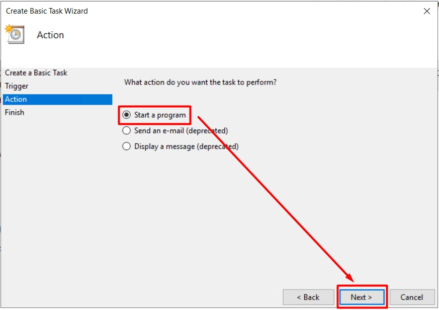

# Prometheus Monitoring

Sparepart Management System is using prometheus for monitoring running instances. The instances are:

1. API Server (Windows)
2. Database Server (Linux)
3. Database Instance (MySQL)

These are the general Components needed to complete the monitoring system.

- [Prometheus Server](#prometheus-server)
- [Windows Exporter](#windows-exporter)
- [Node Exporter](#node-exporter)
- [Mysql Exporter](#install-mysql-exporter)
- [Grafana Server](#grafana-server)

## Prometheus Server
Prometheus Server is the central of the monitoring data. The metrics are provided by the exporter and scraped by the Prometheus Server in an interval of time. You need a dedicated server, separated from the machines and instances being monitored. 
### Install Prometheus Server
- Download the latest version of prometheus from the official website https://prometheus.io/download/
- Extract the downloaded file and go to the directory where the prometheus is extracted.
- Run the following command to start the prometheus server
  ```sh
  ./prometheus --config.file=prometheus.yml
  ```
- Open the browser and go to the http://localhost:9090

## Windows Exporter
Windows Exporter is one of the metrics provider. It provides metrics related to Windows System Information. The Windows Exporter is installed in the API web server. Please do the following steps to install the Node Exporter:

- [Install Windows Exporter](#install-windows-exporter)
- [Create a Task Scheduler](#create-a-task-scheduler)

### Install Windows Exporter
- Download the latest version of Windows Exporter from the official website.
- Extract the downloaded file and navigate to the directory where Windows Exporter is extracted.
- Open a command prompt or PowerShell window in administrator mode.
- Run the following command to start the Windows Exporter:
  ```sh
  windows_exporter.exe
  ```
- Open a web browser and go to http://localhost:9182/metrics to verify that the Windows Exporter is running and providing metrics.
- Configure Prometheus to scrape metrics from the Windows Exporter by adding the following job configuration to the `prometheus.yml` file:
  ```yaml
  - job_name: 'SAMSON Monitoring'
    static_configs:
      - targets: ['localhost:9182']
        labels:
          group: 'sms_service_api'
  ```
- Restart the Prometheus Server for the configuration changes to take effect.
- Verify that Prometheus is successfully scraping metrics from the Windows Exporter by checking the targets page in the Prometheus web interface.
- You can now use the metrics provided by the Windows Exporter for monitoring and alerting in your Sparepart Management System.- Download the latest version of Windows Exporter from the official website.

### Create a Task Scheduler
- Open Task Scheduler by Pressing `⊞ Win + R` and enter `taskschd.msc`.
- Create a task by clicking `Create basic task` button on the top right corner.

  
  
- Fill the task name and click next.

  
  
- Select `When the computer starts` as the task trigger.

  

- Select `Start a program` as the task action.

  

- Select `C:\windows_exporter\windows_exporter.exe` as the Task Program and `--config.file="C:\windows_exporter\config.yml" --config.file.insecure-skip-verify` as the argument.

  

- Review the task, check `Open properties dialog for this task when I click Finish`, and click `Finish`

  

- In the general tab:
  - Change the user to run the task by clicking `Change User or Group`.
  - Select `Run whether user is logged on or not`
  - Check `Do not store password.`
  - Check `Hidden`
  
  

- In the condition tab, uncheck `Start the task only if the computer is on AC power`

  

- In the settings tab, uncheck `Stop the task if it runs longer than`.

  
- Click `OK` to finalize the configuration.
- Select the `Windows Exporter` Task and click `Run`

  
    
## Node Exporter
Node Exporter is one of the metrics provider. It provides metrics related to Linux System Information. The Node Exporter is installed in the database server. Please do the following steps to install the Node Exporter:
- [Install Node Exporter](#install-node-exporter)
- [Create a Custom Node Exporter Service](#create-a-custom-node-exporter-service)
- [Configure Prometheus Server (Node Exporter)](#configure-prometheus-server-node-exporter)

### Install Node Exporter
- SSH to the linux server.
- Download the latest Node Exporter in https://prometheus.io/download/. Below is the example of the script to download the Node Exporter. Please adjust the link accordingly.
  ```sh
  $ wget https://github.com/prometheus/node_exporter/releases/download/v1.8.2/node_exporter-1.8.2.linux-amd64.tar.gz
  ```
- Create a user to exeute the service
  ```sh
  sudo useradd -rs /bin/false node_exporter
  ```
- Extract the tar with the following command:
  ```sh
  $ tar xvf node_exporter*.tar.gz
  $ sudo mv node_exporter-*.linux-amd64/node_exporter /usr/local/bin/
  ```
- Assign the permission needed to the user created earlier (node_exporter):
  ```sh
  $ sudo chmod +x /usr/local/bin/node_exporter
  ```
- Confirm installation by checking version of node_exporter
  ```sh
  $ node_exporter --version
  ```
  below are the output of the command
  ```sh
  node_exporter, version 1.8.2 (branch: HEAD, revision: f1e0e8360aa60b6cb5e5cc1560bed348fc2c1895)
    build user:       root@03d440803209
    build date:       20240714-11:53:45
    go version:       go1.22.5
    platform:         linux/amd64
    tags:             unknown
  ```

### Create a Custom Node Exporter Service
- Create a node_exporter service file under systemd.
  ```sh
  $ sudo vi /etc/systemd/system/node_exporter.service
  ```
- Add the following service file content to the service file and save it.
  ```sh
  [Unit]
  Description=Node Exporter
  After=network.target

  [Service]
  User=node_exporter
  Group=node_exporter
  Type=simple
  ExecStart=/usr/local/bin/node_exporter

  [Install]
  WantedBy=multi-user.target
  ```
- Reload the system daemon, enable, and star the node exporter service.
  ```sh
  $ sudo systemctl daemon-reload
  $ sudo systemctl enable node_exporter
  $ sudo systemctl start node_exporter
  ```
- check the node exporter status to make sure it is running in the active state.
  ```sh
  $ sudo systemctl status node_exporter
  ```
- Below are the output of the command
  ```sh
  ~
  Jul 27 22:44:04 SVR-SMS-DB node_exporter[20778]: ts=2024-07-28T02:44:04.756Z caller=tls_config.go:313 level=info msg="Listening on" address=[::]:9100
  Jul 27 22:44:04 SVR-SMS-DB node_exporter[20778]: ts=2024-07-28T02:44:04.756Z caller=tls_config.go:316 level=info msg="TLS is disabled." http2=false...::]:9100
  ```
- Open a web browser and go to http://localhost:9100/metrics to verify that the Node Exporter is running and providing metrics.
### Configure Prometheus Server (Node Exporter)
- Configure Prometheus to scrape metrics from the Node Exporter by adding the following job configuration to the `prometheus.yml` file:
  ```yaml
  - job_name: 'SAMSON Monitoring'
    static_configs:
      # Windows Exporter configuration
      # ~

      # Node Exporter Configuration
      - targets: ['localhost:9100']
        labels:
          group: 'sms_service_database'
  ```
- Restart the Prometheus Server for the configuration changes to take effect.
- Verify that Prometheus is successfully scraping metrics from the Node Exporter by checking the targets page in the Prometheus web interface.
- You can now use the metrics provided by the Node Exporter for monitoring and alerting in your Sparepart Management System.

## MySQL Exporter
MySQL Exporter is one of the metrics provider. It provides metrics related to MySQL Instance Information. The MySQL Exporter is installed in the database server. Please do the following steps to install the MySQL Exporter:

- [Install MySQL Exporter](#install-mysql-exporter)
- [Configure MySQL Exporter](#configure-mysql-exporter)
- [Create a Custom MySQL Exporter Service](#create-a-custom-mysql-exporter-service)
- [Configure Prometheus Server (MySQL Exporter)](#configure-prometheus-server-mysql-exporter)

### Install MySQL Exporter
- SSH to the linux server.
- Download the latest MySQL Exporter in https://prometheus.io/download/. Below is the example of the script to download the MySQL Exporter. Please adjust the link accordingly.
  ```sh
  $ wget https://github.com/prometheus/mysqld_exporter/releases/download/v0.15.1/mysqld_exporter-0.15.1.linux-amd64.tar.gz
  ```
- Create a user to exeute the service
  ```sh
  sudo useradd -rs /bin/false mysqld_exporter
  ```
- Extract the tar with the following command:
  ```sh
  $ tar xvf mysqld_exporter*.tar.gz
  $ sudo mv mysqld_exporter-*.linux-amd64/mysqld_exporter /usr/local/bin/
  ```
- Assign the permission needed to the user created earlier (mysqld_exporter):
  ```sh
  $ sudo chmod +x /usr/local/bin/mysqld_exporter
  ```
- Confirm installation by checking version of node_exporter
  ```sh
  $ mysqld_exporter --version
  ```
  below are the output of the command
  ```sh
  mysqld_exporter, version 0.15.1 (branch: HEAD, revision: cc349684494b5038ec5a52233bdca9eb9291e6f2)
    build user:       root@d89c15b9f5ad
    build date:       20231212-07:55:09
    go version:       go1.21.5
    platform:         linux/amd64
    tags:             unknown
  ```

### Configure MySQL Exporter
#### Create Prometheus exporter database user
- Login to the mysql client by entering the command below and the password afterward.
  ```sh
  mysql -u root -p
  ```
- The user should have PROCESS, SELECT, and REPLICATION CLIENT grants. Please enter the command below to proceed:
  ```sh
  mysql> CREATE USER 'exporter'@'localhost' IDENTIFIED BY 'StrongPassword' WITH MAX_USER_CONNECTIONS 3;
  mysql> GRANT PROCESS, SELECT, REPLICATION CLIENT, SELECT ON *.* TO 'exporter'@'localhost';
  mysql> FLUSH PRIVILEGES;
  mysql> EXIT
  ```
#### Configure database credentials
- Create database credentials file:
  ```sh
  [client]
  user=exporter #MySQL user created in the step above
  password=StrongPassword
  ```
- Set ownership permissions:
  ```sh
  sudo chown root:mysqld_exporter /etc/.mysqld_exporter.cnf
  ```
### Create a Custom MySQL Exporter Service
- Create a mysqld_exporter service file under systemd.
  ```sh
  $ sudo vi /etc/systemd/system/mysqld_exporter.service
  ```
- Add the following service file content to the service file and save it.
  ```sh
  [Unit]
  Description=Prometheus MySQL Exporter
  After=network.target
  User=mysqld_exporter
  Group=mysqld_exporter

  [Service]
  Type=simple
  Restart=always
  ExecStart=/usr/local/bin/mysqld_exporter \
  --config.my-cnf /etc/.mysqld_exporter.cnf \
  --collect.global_status \
  --collect.info_schema.innodb_metrics \
  --collect.auto_increment.columns \
  --collect.info_schema.processlist \
  --collect.binlog_size \
  --collect.info_schema.tablestats \
  --collect.global_variables \
  --collect.info_schema.query_response_time \
  --collect.info_schema.userstats \
  --collect.info_schema.tables \
  --collect.perf_schema.tablelocks \
  --collect.perf_schema.file_events \
  --collect.perf_schema.eventswaits \
  --collect.perf_schema.indexiowaits \
  --collect.perf_schema.tableiowaits \
  --collect.slave_status \
  --web.listen-address=0.0.0.0:9104

  [Install]
  WantedBy=multi-user.target
  ```
- Reload the system daemon, enable, and star the node exporter service.
  ```sh
  $ sudo systemctl daemon-reload
  $ sudo systemctl enable mysqld_exporter
  $ sudo systemctl start mysqld_exporter
  ```
- check the node exporter status to make sure it is running in the active state.
  ```sh
  $ sudo systemctl status mysqld_exporter
  ```
- Open a web browser and go to http://localhost:9104/metrics to verify that the Node Exporter is running and providing metrics.
### Configure Prometheus Server (MySQL Exporter)
- Configure Prometheus to scrape metrics from the Node Exporter by adding the following job configuration to the `prometheus.yml` file:
  ```yaml
  - job_name: 'SAMSON Monitoring'
    static_configs:
      # Windows Exporter configuration
      # ~

      # MysSQL and Node Exporter Configuration
      - targets: ['localhost:9100', 'localhost:9104']
        labels:
          group: 'sms_service_database'
  ```
- Restart the Prometheus Server for the configuration changes to take effect.
- Verify that Prometheus is successfully scraping metrics from the Node Exporter by checking the targets page in the Prometheus web interface.
- You can now use the metrics provided by the Node Exporter for monitoring and alerting in your Sparepart Management System.

## Grafana Server

<em>*this section can be expanded.</em>

### Install Grafana Server

To install Grafana Server and add Prometheus as one of the datasources, follow these steps:

1. Download the Grafana Server package for your operating system from the official Grafana website.
2. Extract the downloaded package to a desired location on your system.
3. Open a terminal or command prompt and navigate to the extracted Grafana Server directory.
4. Start the Grafana Server by running the appropriate command for your operating system:
   - On Linux: `./bin/grafana-server`
   - On Windows: `.\bin\grafana-server.exe`
5. Open a web browser and go to `http://localhost:3000` to access the Grafana web interface.
6. Log in to Grafana using the default credentials (admin/admin).
7. Change the default admin password to a secure password of your choice.
8. Click on the "Configuration" gear icon in the left sidebar and select "Data Sources" from the dropdown menu.
9. Click on the "Add data source" button.
10. Select "Prometheus" as the data source type.
11. Configure the Prometheus data source by providing the URL of your Prometheus server.
12. Optionally, configure other settings such as authentication and HTTP options.
13. Click on the "Save & Test" button to test the connection to the Prometheus server.
14. If the connection is successful, you will see a green notification indicating that the data source is working.
15. You can now create dashboards and visualizations using the data from Prometheus in Grafana.

Remember to customize the installation and configuration steps based on your specific environment and requirements.
